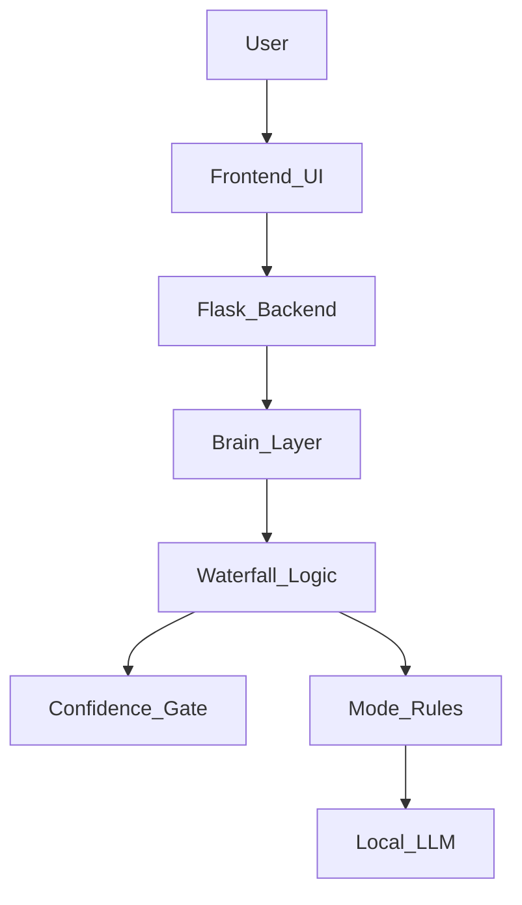

<div align="center">
  <h1>🚀 NeonAI</h1>
  <h3>Local-First Multi-Mode AI System (Experimental)</h3>

  <p>
    
    
    
    
  </p>

  <p>
    <b>Mode-Driven Intelligence • Privacy Focused • System > Model</b>
  </p>

  <br>
  
  
  <br><br>
</div>

---

## 🧠 What Is NeonAI?

**NeonAI** is a local-first AI system designed to run primarily on your own machine using a local LLM pipeline, with optional and controlled internet access for selected features.

What started as an experiment gradually evolved into a complete AI system architecture with multiple operational modes, strict behavior control, and a premium custom UI.

> ⚠️ **This is not a chatbot wrapper.**
> NeonAI is an AI system with modes, rules, confidence gates, memory, and decision pipelines.

---

## ✨ Core Philosophy

* 🧠 **Local LLM First** — No mandatory cloud LLM APIs.
* 🔒 **Privacy-Focused** — Data stays on the user’s machine.
* 🎯 **Mode-Driven Intelligence** — AI behavior depends on context.
* 🧪 **Experimental by Design** — Built to explore system ideas.
* 🧩 **System > Model** — The LLM is a tool, not the decision-maker.

---

## 🎮 Modes & Functionality

NeonAI is a multi-mode AI assistant that can switch between different roles, each with its own rules and permissions.

| Mode | Purpose |
| :--- | :--- |
| **NEON CASUAL** | General chat using a local LLM with memory. |
| **NEON MOVIES** | Movie discovery, recommendations & metadata. |
| **NEON STUDY** | PDF-based syllabus learning (**Strict Offline**, No Hallucinations). |

*Each mode enforces different constraints, memory usage, and access permissions.*

---

## 🧱 System Architecture

**Key Principle:** The LLM never directly decides responses. All outputs pass through rules, confidence checks, and mode restrictions.


🖥️ Frontend (UI)
Pure HTML, CSS, JavaScript (No frameworks).

GSAP-powered animations.

10+ Neon Themes + Light / Dark mode.

Physics-based Liquid Toggle.

Fully responsive (Desktop + Mobile).

Note on Structure:

templates/: Contains UI files (index.html, styles.css, app.js) served via Flask.

static/: Currently used for user-uploaded wallpapers.

The frontend is not an SPA. It is a controlled UI panel, intentionally simple and stable.

🎬 NEON MOVIES Mode
Displays trending movies.

Uses TMDB API (Optional).

Auto-scroll carousel with hover/touch pause.

Learns user genre preferences.

Offline Fallback: Uses a local movie database if internet is unavailable.

📚 NEON STUDY (Exam Mode)
RAG Pipeline: Upload a PDF syllabus.

Indexes content locally using a Vector Database.

Strict Rule: If the answer is not present in the PDF → The AI Refuses.

Internet access is Completely Blocked in this mode.

Designed for exam-safe, hallucination-free learning.

🧠 Local LLM Engine
NeonAI does not depend on cloud LLM APIs.

Powered by local models (via Ollama).

Fully offline capable.

Internet access is optional and gated.

External APIs never override system rules.

📂 Project Structure
```Plaintext

NeonAI/
│
├── server.py              # Flask backend (API + routing)
├── START_NEON.bat         # One-click launcher (Windows)
│
├── brain/                 # Core AI system logic
│   ├── waterfall.py       # Decision flow & routing
│   ├── confidence_gate.py # Confidence & hallucination control
│   ├── memory.py          # Session & long-term memory
│   └── gk_engine.py       # Knowledge & reasoning engine
│
├── models/                # LLM abstraction layer
│   ├── local_llm.py       # Local LLM interface (offline-first)
│   └── hybrid_llm.py      # Local + optional online logic
│
├── exam/                  # NEON STUDY (Exam Mode)
│   ├── indexer.py         # PDF indexing
│   └── retriever.py       # Strict PDF-only retrieval
│
├── movie/                 # NEON MOVIES engine
│   ├── engine.py          # Recommendation logic
│   └── lookup.py          # Movie metadata
│
├── web/                   # Controlled web adapters
│   ├── search_adapter.py  # Optional web search
│   └── movie_adapter.py   # TMDB logic
│
├── templates/             # Frontend UI
│   ├── index.html
│   ├── styles.css
│   └── app.js
│
└── user_data/
    └── profile.json       # Local user profile & preferences
```
▶️ How to Run
1️⃣ Requirements
```
Python 3.10+
```
Local LLM runtime (e.g., Ollama) installed and running.

2️⃣ Install Dependencies
```Bash

pip install -r requirements.txt
```
3️⃣ Start NeonAI
Double-click START_NEON.bat Or run manually via terminal:

```Bash

python server.py
Open in Browser: http://localhost:5000
```
🧪 Project Status
✅ Core system functional

✅ UI stable & responsive

✅ Multi-mode logic working

⚠️ Experimental (Architecture locked for iteration)

⚠️ Disclaimer
This is an experimental project built for learning, research, and AI system design exploration. It is not a commercial product.

<div align="center"> <h3>🧠 Author</h3> <b>Ansh</b>


<i>B.Tech CSE</i>


<b>Focus Areas:</b>


AI Systems (not just models) • Offline-first Architecture • Controlled AI Design


<i>"NeonAI is not about how smart the model is. It’s about how controlled, safe, and purposeful AI should be."</i>

</div>
